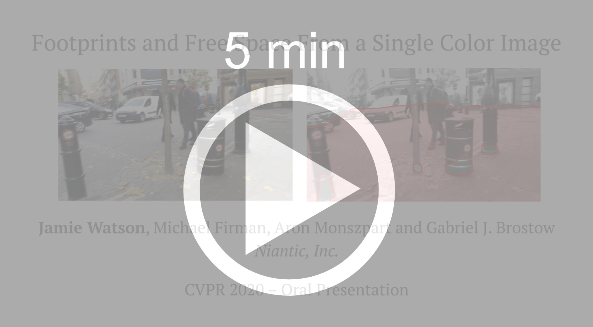
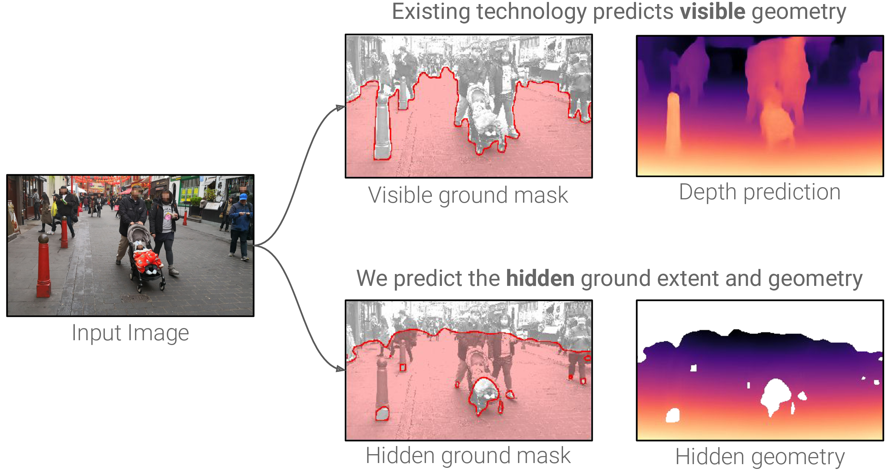
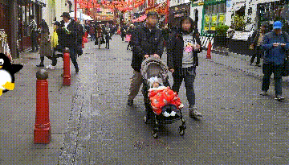
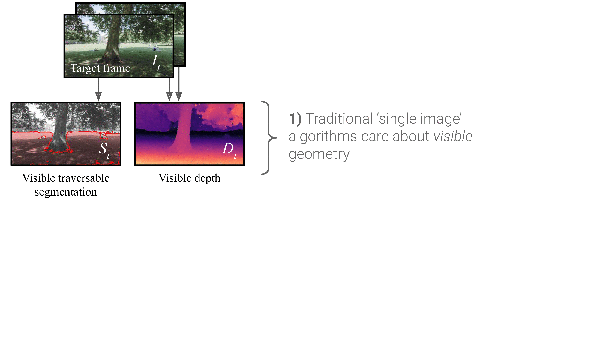

# [Footprints and Free Space from a Single Color Image](https://arxiv.org/abs/2004.06376)

**[Jamie Watson](https://scholar.google.com/citations?view_op=list_works&hl=en&user=5pC7fw8AAAAJ), [Michael Firman](http://www.michaelfirman.co.uk), [Aron Monszpart](http://aron.monszp.art) and [Gabriel J. Brostow](http://www0.cs.ucl.ac.uk/staff/g.brostow/) – CVPR 2020 (Oral presentation)**

[[Link to Paper](https://arxiv.org/abs/2004.06376)]


**We introduce *Footprints*, a method for estimating the visible and hidden traversable space from a single RGB image**


<p align="center">
  <a href="https://storage.googleapis.com/niantic-lon-static/research/footprints/Main_with_yeti_h264.mp4">
  
  </a>
</p>

Understanding the shape of a scene from a single color image is a formidable computer vision task.
Most methods aim to predict the geometry of surfaces that are visible to the camera, which is of limited use when planning paths for robots or augmented reality agents. Models which predict beyond the line of sight often parameterize the scene with voxels or meshes, which can be expensive to use in machine learning frameworks.

Our method predicts the hidden ground geometry and extent from a single image:

<p align="center">
  
</p>

Our predictions enable virtual characters to more realistically explore their environment.

<table width="700" align="center">
  <tr>
    <td></td>
    <td></td>
  </tr>
  <tr>
    <td><b>Baseline:</b> The virtual character can only explore the ground visible to the camera</td>
    <td><b>Ours:</b> The penguin can explore both the visible and hidden ground</td>
  </tr>
</table>


## ⚙️ Setup

Our code and models were developed with PyTorch 1.3.1.
The `environment.yml` and `requirements.txt` list our dependencies.

We recommend installing and activating a new conda environment from these files with:
```shell
conda env create -f environment.yml -n footprints
conda activate footprints
```


## 🖼️ Prediction

We provide three pretrained models:

- `kitti`, a model trained on the KITTI driving dataset with a resolution of 192x640,
- `matterport`, a model trained on the indoor Matterport dataset with a resolution of 512x640, and
- `handheld`, a model trained on our own handheld stereo footage with a resolution of 256x448.

We provide code to make predictions for a single image, or a whole folder of images, using any of these pretrained models.
Models will be [automatically downloaded when required](footprints/utils.py#L105), and input images will be automatically resized to the [correct input resolution](footprints/predict_simple.py#21) for each model.

Single image prediction:
```shell
python -m footprints.predict_simple --image test_data/cyclist.jpg --model kitti
```

Multi image prediction:
```shell
python -m footprints.predict_simple --image test_data --model handheld
```

By default, `.npy` predictions and `.jpg` visualisations will be saved to the `predictions` folder; this can be changed with the `--save_dir` flag.

## 🚋 Training

To train a model you will need to download raw [KITTI](http://www.cvlibs.net/datasets/kitti/index.php) 
and [Matterport](https://niessner.github.io/Matterport/) data. Edit the `dataset` field in `paths.yaml` to point to
the downloaded raw data paths.

For details on downloading KITTI, see [Monodepth2](https://github.com/nianticlabs/monodepth2).

You will also need per-image training data generated from the video sequences:
- visible ground segmentations
- hidden ground depths
- depth maps
- etc.

Our versions of these can be found [HERE](https://console.cloud.google.com/storage/browser/niantic-lon-static/research/footprints/data). 
Download these and edit the `training_data` field of `paths.yaml` to point to them.

After this your `paths.yaml` should look like:

```
# Contents of paths.yaml
  kitti:
    dataset: <your_raw_KITTI_path>
    training_data: <downloaded_KITTI_training_data>

  matterport:
    dataset: <your_raw_matterport_path>
    training_data: <downloaded_matterport_training_data>

  ...
```

Now you have everything you need to train!

Train a KITTI model using:
```shell
CUDA_VISIBLE_DEVICES=X python -m footprints.main \
    --training_dataset kitti \
    --log_path <your_log_path> \
    --model_name <your_model_name>
```

and a Matterport model using:
```shell
CUDA_VISIBLE_DEVICES=X python -m footprints.main \
    --training_dataset matterport \
    --height 512  --width 640 \
    --log_path <your_log_path> \
    --batch_size 8 \
    --model_name <your_model_name>
```

## Training data generation

If you want to generate your own training data instead of using ours
(e.g. you want to try a better ground segmentation algorithm, or more accurate camera poses) then
you can!

There are several key elements of our training data - each can be swapped out for your own.

### Visible depths
For KITTI we used [PSMNet](https://github.com/JiaRenChang/PSMNet) to generate disparity maps for stereo pairs.
These are inside `stereo_matching_disps`, and are used to generate training labels. These are
converted to depth maps using the known focal length and baseline.
Matterport provides these.

### Camera poses
For KITTI we used [ORBSLAMv2](https://github.com/raulmur/ORB_SLAM2) to generate camera poses, which are stored as `npys` inside
the `poses` folder. These are used to reproject between cameras.
Matterport provides these.

### Ground segmentations
For both Matterport and KITTI we trained a segmentation network to classify ground pixels in an image.
We provide training code for this inside `footprints/preprocessing/segmentation`. These are stored inside
the `ground_seg` folder as `npys` and are unthresholded (i.e. raw sigmoid output).

### Optical flow
For KITTI, we identify moving objects by comparing `induced flow` to `optical flow`. Our provided optical
flow estimates come from [LiteFlowNet](https://github.com/twhui/LiteFlowNet), and are inside the `optical_flow` folder.

### Hidden ground depths
To compute hidden depths (i.e. the depth to each visible and occluded ground pixel) we use camera poses,
depth maps and ground segmentations. These can be generated using (expects a GPU to be available):
```script
CUDA_VISIBLE_DEVICES=X  python -m \
    footprints.preprocessing.ground_truth_generation.ground_truth_generator \
    --type hidden_depths  --data_type kitti --textfile splits/kitti/train.txt
```
Make sure to run this on both `train.txt` and `val.txt`. Warning - this will take a while, so to speed things
up you can do this in parallel by running multiple processes and adding the flags `--start_idx X` and
`--end_idx Y` to split the textfile into smaller chunks. 

Note that if you have already downloaded our training data, running this command will overwrite it unless you 
set `--save_folder_name <my_save_folder>`. To actually train using this, you can manually set the path inside
`footprints/datasets/<kitti or matterport dataset.py>`, 
or rename your new data to the required folder name, e.g. `hidden_depths`.

### Moving object masks
To compute moving objects masks we use optical flow, depth, ground segmentations and camera poses. These can be
generated by amending the above command with `--type moving_objects`. This is only valid
for KITTI.

### Depth masks
Depth masks are estimates of the *untraversable* pixels in the image, and are computed using
depth maps and ground segmentations. To generate these change the above command to use
`--type depth_masks`.

## ⏳ Evaluation

To generate predictions for evaluation using a trained model, run:
```shell
CUDA_VISIBLE_DEVICES=X python -m footprints.main \
    --mode inference \
    --load_path <your_model_path, e.g. logs/model/models/weights_9> \
    --inference_data_type <kitti or matterport> \
    --height <192 for kitti, 512 for matterport> \
    --width 640
```
By default this will save to `<load_path>/<data_type>_predictions`, but can be specified with
`--inference_save_path`.

To evaluate a folder of predictions, run:
```shell
python -m footprints.evaluation.evaluate_model \
    --datatype kitti \
    --metric iou \
    --predictions <path/to/predictions/folder>
```

The following options are provided:
- `--datatype` can be either `kitti` or `matterport`.
- `--metric` can be `iou` (both `kitti` and `matterport`) or `depth` (for `matterport`)

If necessary, the ground truth files will be automatically downloaded and placed in the `ground_truth_files` folder.

You can also download the KITTI annotations directly from [here](https://storage.googleapis.com/niantic-lon-static/research/footprints/data/kitti/kitti_ground_truth.zip).
For each image, there are 3 `.png` files:

- `XXXXX_ground.png` contains the mask of the boundary of visible and hidden ground, ignoring all objects
- `XXXXX_objects.png` contains the mask of the ground space taken up by objects (the *footprints*)
- `XXXXX_combined.png` contains the full evaluation mask - the visible and hidden ground, taking into account object footprints

## Method and further results

We learn from stereo video sequences, using camera poses, per-frame depth and semantic segmentation to form training data, which is used to supervise an image-to-image network.

<p align="center">
  
</p>

Results on mobile phone footage:

<table width="700" align="center">
  <tr>
    <td></td>
    <td></td>
  </tr>
</table>

More results on the KITTI dataset:
<p align="center">
  
</p>


## ✏️ 📄 Citation

If you find our work useful or interesting, please consider citing [our paper](https://arxiv.org/abs/2004.06376):

```
@inproceedings{watson-2020-footprints,
 title   = {Footprints and Free Space from a Single Color Image},
 author  = {Jamie Watson and
            Michael Firman and
            Aron Monszpart and
            Gabriel J. Brostow},
 booktitle = {Computer Vision and Pattern Recognition ({CVPR})},
 year = {2020}
}
```


# 👩‍⚖️ License
Copyright © Niantic, Inc. 2020. Patent Pending. All rights reserved. Please see the license file for terms.
